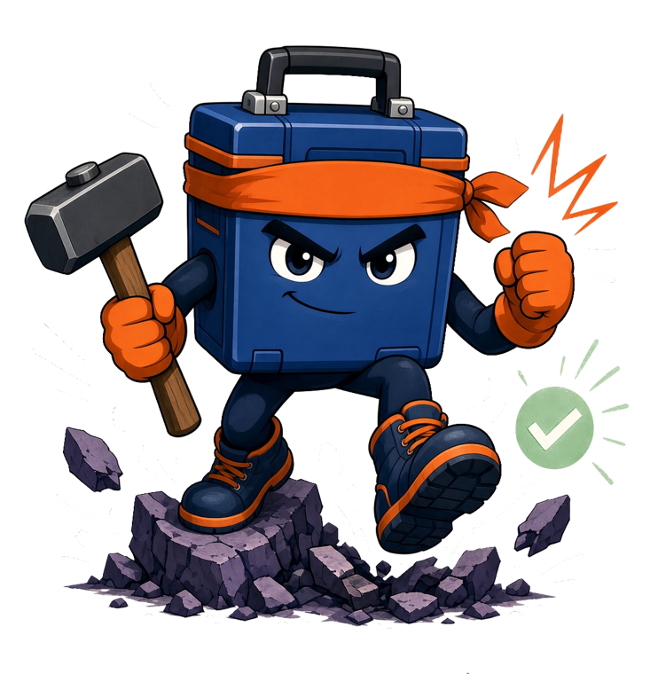

<p align="center">
  
</p>

<h1 align="center">Laravel Tackle</h1>

<p align="center">
  <a href="https://packagist.org/packages/jordandalton/laravel-tackle"></a>
  <a href="https://github.com/JordanDalton/laravel-tackle/actions/workflows/tests.yml"></a>
  <a href="https://packagist.org/packages/jordandalton/laravel-tackle"></a>
  <a href="LICENSE.md"></a>
</p>

<p align="center"><strong>An AI agent harness for Laravel</strong> — the runtime layer that lets AI agents operate <em>inside</em> your app: reading code, running tools and tests, and taking action, with safety boundaries enforced at the framework level.</p>

Think Claude Code or Codex, but purpose-built for Laravel and installed via Composer. Built on [`laravel/ai`](https://github.com/laravel/ai) and **provider-agnostic** — Anthropic (Claude) by default; OpenAI, Gemini, Groq, or local Ollama are two env vars away.

> 📚 **Full documentation → [tackle.jordandalton.com](https://tackle.jordandalton.com)**

## Quick start

```bash
composer require jordandalton/laravel-tackle
```

Set a provider key in `.env` (Anthropic by default):

```env
ANTHROPIC_API_KEY=sk-ant-...
```

Then start an interactive coding session:

```bash
php artisan ai:code
```

That's it — see [Your First Session](https://tackle.jordandalton.com/guide/first-session) for the guided tour. Requires **PHP 8.3+** and **Laravel 12 or 13**.

## What's in the box

A family of agents, all sharing one tool infrastructure and safety layer:

| Command | What it does |
|---|---|
| [`ai:code`](https://tackle.jordandalton.com/agents/interactive) | Interactive coding agent — reads the codebase, edits files, runs tests, plan mode, slash commands, context compaction. |
| [`ai:run`](https://tackle.jordandalton.com/agents/headless) | The same agent headless — one task, a JSON result, an exit code. For CI and cron. |
| [`ai:fix`](https://tackle.jordandalton.com/agents/fix) | Focused fix session — paste an exception or point it at a Sentry / GitHub issue; it diagnoses, patches, and verifies. |
| [`ai:review`](https://tackle.jordandalton.com/agents/review) | Read-only diff review with severity levels; posts inline comments on a PR. |
| [`ai:onboard`](https://tackle.jordandalton.com/agents/onboard) | A read-only tour of a codebase for a new developer; `--write` saves `docs/ONBOARDING.md`. |
| [`ai:upgrade`](https://tackle.jordandalton.com/agents/upgrade) | Safe major-version Composer upgrades — audit, plan, fix, verify — delivered as a PR. |
| [`ai:eval`](https://tackle.jordandalton.com/agents/eval) | Benchmark the agent against seeded bugs — fix rate, false-fix rate, tokens, cost. |
| [Self-healer](https://tackle.jordandalton.com/agents/self-healing) | Autonomous agent that heals failed jobs, scheduled tasks, and [Nightwatch](https://tackle.jordandalton.com/integrations/nightwatch) production issues — verifies the fix, opens a PR. |

Plus [`ai:explain`](https://tackle.jordandalton.com/agents/explain-and-test), [`ai:test`](https://tackle.jordandalton.com/agents/explain-and-test#generate-tests), and [`ai:respond`](https://tackle.jordandalton.com/agents/review).

Every agent is extensible — [add your own tools](https://tackle.jordandalton.com/extending/custom-tools), [write new agents](https://tackle.jordandalton.com/extending/custom-agents), [hook the tool lifecycle](https://tackle.jordandalton.com/extending/hooks), or [swap the default agent](https://tackle.jordandalton.com/extending/custom-agents) — without forking. And the terminal isn't the only way in: [Tackle Remote](https://tackle.jordandalton.com/integrations/remote) drives the same harness from your phone.

## Documentation

Everything lives at **[tackle.jordandalton.com](https://tackle.jordandalton.com)**:

- **Guide** — [What is Tackle?](https://tackle.jordandalton.com/guide/what-is-tackle) · [Installation](https://tackle.jordandalton.com/guide/installation) · [First Session](https://tackle.jordandalton.com/guide/first-session) · [Configuration](https://tackle.jordandalton.com/guide/configuration) · [Project Instructions](https://tackle.jordandalton.com/guide/project-instructions) · [Session Memory](https://tackle.jordandalton.com/guide/session-memory) · [Safety](https://tackle.jordandalton.com/guide/safety)
- **The Agents** — [interactive](https://tackle.jordandalton.com/agents/interactive) · [headless](https://tackle.jordandalton.com/agents/headless) · [fix](https://tackle.jordandalton.com/agents/fix) · [review](https://tackle.jordandalton.com/agents/review) · [onboard](https://tackle.jordandalton.com/agents/onboard) · [upgrade](https://tackle.jordandalton.com/agents/upgrade) · [eval](https://tackle.jordandalton.com/agents/eval) · [self-healing](https://tackle.jordandalton.com/agents/self-healing)
- **Integrations** — [GitHub](https://tackle.jordandalton.com/integrations/github) · [Sentry](https://tackle.jordandalton.com/integrations/sentry) · [Nightwatch](https://tackle.jordandalton.com/integrations/nightwatch) · [MCP](https://tackle.jordandalton.com/integrations/mcp) · [Remote](https://tackle.jordandalton.com/integrations/remote)
- **Extending** — [tools](https://tackle.jordandalton.com/extending/custom-tools) · [agents](https://tackle.jordandalton.com/extending/custom-agents) · [hooks](https://tackle.jordandalton.com/extending/hooks) · [subagents](https://tackle.jordandalton.com/extending/subagents) · [models & providers](https://tackle.jordandalton.com/extending/models)
- **Reference** — [commands](https://tackle.jordandalton.com/reference/commands) · [tools](https://tackle.jordandalton.com/reference/tools)

## Safety

Tackle edits code and runs commands, and the boundaries are enforced in PHP, not by prompting: protected paths, per-environment [shell modes](https://tackle.jordandalton.com/guide/configuration#shell-modes), artisan allowlists, spend budgets, and worktree isolation. See [Safety](https://tackle.jordandalton.com/guide/safety).

Two things worth knowing before you start:

- **Run it inside a committed git tree** so you always have a clean undo (`git checkout -- .`).
- **`laravel/ai` is new and fast-moving.** It reshapes its `Agent` contract on most 0.x minors, and an incompatible signature is a compile-time fatal. Tackle supports `>=0.1 <0.11` and CI runs the suite across that range on PHP 8.3 and 8.4.

## Contributing

```bash
composer install
./vendor/bin/pest    # run the test suite
./vendor/bin/pint    # format
```

Bug reports and pull requests are welcome on [GitHub](https://github.com/JordanDalton/laravel-tackle/issues).

## Security

If you discover a security issue, please email jordan.dalton@ymail.com rather than opening a public issue.

## License

Laravel Tackle is open-sourced software licensed under the [MIT license](LICENSE.md).
